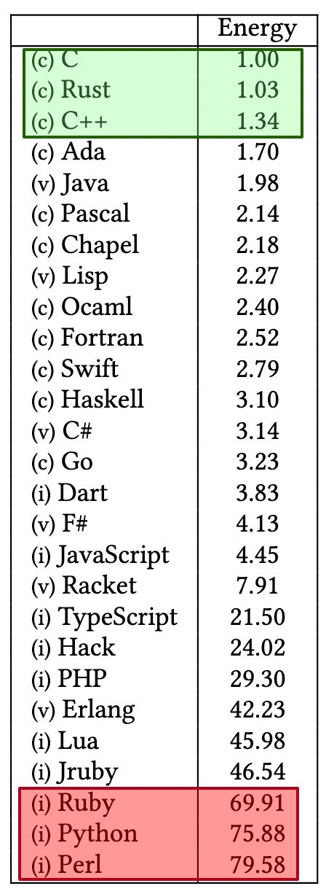

# RUST <!-- omit in toc -->

> "if i had more time i would have written a shorter letter"
>
> ~ Multiple sources

This is a little long a the moment.  I intend to edit it for brevity, but for the moment it's a stream of consciousness.

Rust has been a breath of fresh air for me, and feels like a return to the kind of programming that I did at the start of my career.  As time has progressed abstractions have increased and we see ourselves further and further away from understanding how computers work.

- [Pros](#pros)
  - [Multi-platform](#multi-platform)
  - [Ease of Entry](#ease-of-entry)
  - [Enums \& pattern matching](#enums--pattern-matching)
  - [More matching](#more-matching)
  - [Error Handling incl ?](#error-handling-incl-)
  - [Null Handling](#null-handling)
  - [fmt](#fmt)
  - [Strong typing](#strong-typing)
  - [Memory safety](#memory-safety)
  - [Macros](#macros)
  - [cargo](#cargo)
  - [Generics](#generics)
  - [Deferred execution](#deferred-execution)
  - [Trailing commas](#trailing-commas)
  - [Blocks as expressions](#blocks-as-expressions)
  - [testing](#testing)
  - [Performance](#performance)
  - [Energy Efficiency](#energy-efficiency)
- [Cons](#cons)
  - [Learning Curve](#learning-curve)
    - [Lifetimes](#lifetimes)
    - [Generics](#generics-1)
  - [Harsh task master](#harsh-task-master)
  - [Unlearning Object Oriented](#unlearning-object-oriented)


# Pros

## Multi-platform

* Windows
* Linux
* Mac
* Embedded
* targets

## Ease of Entry

The first thing I was struck with with Rust was how easy it was to kick off, thanks to [The Rust Book](https://doc.rust-lang.org/book/ch01-00-getting-started.html).

It was just a handfull of commands and I had my first Rust application (the obligatory "Hello World") up and running.

```sh
curl --proto '=https' --tlsv1.2 https://sh.rustup.rs -sSf | sh

cargo new hello-world
cd hello-world
cargo run
```

This created the following `src/main.rs`
```rust
fn main() {
    println!("Hello, world!");
}
```

After have spent the previous years working with C#, javascript/node and then python this just blew my mind.  Four lines and I had a running program.

So, first things first, let's recognise what a great job has been done with both The Rust Book and secondly the tools.

## Enums & pattern matching

This is a topic that overlaps two following sections ([ErrorHandling](#error-handling) and [Null Handling](#null-handling)), as it's the way that rust handles Enums and matching that allows them both.  Let's have a look.

Rust supports simple enums as follows:

```rust
enum Pet {
    Dog,
    Cat,
}
```

but the magic really starts when first we look at how Rust matches enums, with syntax that looks quite familiar.

```rust
match (pet) {
    Animal::Dog => println!("It's a dog!"),
    Animal::Cat => println!("It's a cat!"),
}
```

but the real magic of Rust enums starts to become evident when we see how enums can embed other values.

```rust
    enum Pet {
        Dog,
        Cat,
        Exotic(String),
    }
```

which allows us to write the following:

```rust
    match (pet) {
        Animal::Dog => println!("It's a dog!"),
        Animal::Cat => println!("It's a cat!"),
        Animal::Exotic(name) => println!("Ooh, you have a {}", name),
    }
```
and we could also write something similar using `if let`

```rust
    if let Animal::Exotic(name) == pet {
        println!("Ooh, you have a {}", name);
    }
```

## More matching

Anyone recognise this?

```rust
    fn main() {
        for i in 1..100 {
            match (i, i % 5 == 0, i % 3 == 0) {
                (_, true, true) => println!("FizzBuzz"),
                (_, true, _)    => println!("Buzz"),
                (_, _, true)    => println!("Fizz"),
                (v, _, _)       => println!("{}", v),
            }
        }
    }
```

## Error Handling incl ?

There are no exceptions in Rust, and instead it's been replaced by the `Result` enum.  Exceptions were a solution to a problem that occured in handling errors in languages like `c`, but they in turn introduce problems of their.  The two primary problems were: 1) There was a second path through your logic; 2) No one understood them and they were scared.

```rust
    fn do_something() -> Result<u32, String> {
        Err("This went wrong")
    }

    fn main() -> Result<(), String> {
        do_something()?;
        Ok(())
    }
```

## Null Handling

The number one bug in the world is a failed assumption, represented by the dreaded `NullReferenceException` in java and C#.  If you ever encounter one of these in
your programs it means you made an assumption and were proven wrong.

Rust does away with Null as a value, and replaces it with the `Result` enum, which
can take the value `Some(x)` and `None`.

```rust
    let good = Option::Some(123);
    let bad = Option::None;
```

Now, if your code has to deal with optional data it must do so explictly.

```rust
fn do_something() -> Option<u32> {
    // stuff
}

fn main() {
    match do_something() {
        Some(v) => println!("It returned {}", v),
        None => println!("It returned nothing"),
    }
}
```

## fmt

Rust has a linter/formatter baked into it from day one.

```sh
cargo fmt
```

Stops the "tabs vs spaces" debate.  Rust has decided and everyone will fall in line, and treats everyone as equals.

## Strong typing


## Memory safety

There were two main ways of handling memory to this point:

1. Explitic allocation/deallocated (like C, C++, Pascal, etc.)
2. Garbage collection (like java & C#)

Both had their own problems, such as memory leaks and poor performance during garbage collection, and a mistake belief that garbage collected software couldn't suffer memory leaks.

Rust introduces a third way.  All memory is allocated and deallocated within a scope.

```rust
fn main() {
    let a = "1234";
    {
        let b = "5678";
    } // <-- b is deallocated here
    println!("{}{}", a, b); // BUG: b is out of scope
} // <- a is deallocated here
```

In the examples above we can see that `a` and `b` are tied to the `{}` scopes in which they are declared.

This introduces a couple of other problems that need to be resolved.  Namely that references need to be given a lifetime (e.g. `&'static str`) and that memory needs to be moved (using `move`) or copied.  This can be quite confusing (and is therefore listed under the [cons](#cons) section) but is key to writing performant code.

## Macros

```rust
    let value = json!(
        {
            "foo": 1,
            "bar": 2,
            "meep": 3
        }
    );
```

## cargo

## Generics

## Deferred execution

## Trailing commas

This is a tiny one.

```rust
enum Animal {
    Cat,
    Dog,
    Fish, // <- look at this
}
```

This just means that your `git` history and pull requires are a little neater, because I don't have to edit the `Fish` line when I add `Bird` in the future.  As I said.  Tiny.

## Blocks as expressions 

## testing

* unit
* integration
* documentation

## Performance

* https://blog.scanner.dev/serverless-speed-rust-vs-go-java-python-in-aws-lambda-functions/
* https://filia-aleks.medium.com/aws-lambda-battle-2021-performance-comparison-for-all-languages-c1b441005fd1

## Energy Efficiency

Using C as the base line Rust consumes `1.03` times the energy, whereas python consumes `75.88` times the energy.  That number is enormous, and why we see a lot of python libraries (such as pydantic) calling out to Rust to handle their high-performance and memory intensive aspects.



# Cons

## Learning Curve

This [guy](https://tyrchen.github.io/rust-training) has a brilliant image regarding the Rust learning curve.  Made me laugh.


### Lifetimes

```rust
fn longest<'l>(a: &'l str, b: &'l str) -> &'l str {
    if a.len() > b.len() {
        a
    } else {
        b
    }
}

fn main() {
    let a = "This is short";
    let c: &str;
    {
        let b = "This is the longest message";
        c = longest(&a, &b);
    }
    println!("{}", c); // >"This is the longest message"
}
```


### Generics

Learning generics can be quite intimidating for new developers and can lead to some code that is pretty hard to read.  Generics are quite frequently used to allow for the fact that Rust does not want you to use polymorphic references.

```csharp
public abstract class Animal {}

public class Dog: Animal {}
public class Cat: Animal {}

public void do_something(Animal animal) {}
```

```rust
trait Animal {}
struct Dog;
struct Cat;
impl Animal for Dog {}
impl Animal for Cat {}

fn do_something<A: Animal>(animal: A) {}
fn do_something_dyn(impl animal: Animal) {}
```

## Harsh task master

Rust does not go easy on you with the compile time errors.  It forces you to face your demons up front, where other languages will let this slide.  This means that you can spend a lot of time trying to figure out why some error message is being thrown and how you need to restructure your code to fix it, but the benefit is that you eliminate bugs before they ever get the chance to occur.

## Unlearning Object Oriented

One of the consistent problems I've had is trying to unlearn decades worth of object oriented problems, primarily a lack of inheritence.  Again, inheritence was the root of a lot of bad behaviours in other languages.  Deeply nested trees and descendents that violated the liskov substitution principle.
